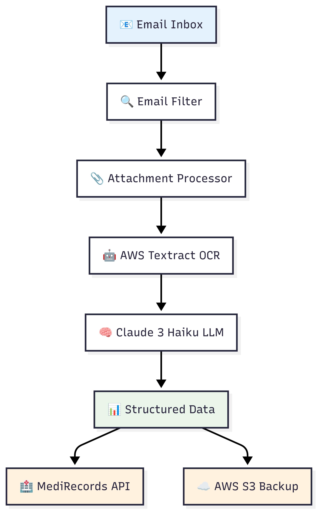

# Referral Automation Pipeline

## Overview

This system automates the extraction of structured referral data from email attachments (PDFs, images, DOCX) and delivers the extracted data to MediRecords or Amazon S3. It uses AWS Textract for OCR, AWS Bedrock (Claude 3 Haiku) for LLM processing, and Microsoft Graph API for email extraction. The system is designed to comply with HIPAA and the Australian Privacy Act 1998.

---

## Quick Start

### Prerequisites

* AWS Account with appropriate IAM permissions
* Microsoft Graph API credentials
* MediRecords API credentials
* Python 3.9+

### Installation

```bash
# Clone the repository
git clone https://github.com/your-org/referralemailwork.git
cd referralemailwork

# Install dependencies
pip install -r requirements.txt

# Configure AWS credentials
aws configure

# Run locally
python run.py
```

### Configuration

Update `referral_automation/config.py` with your configuration values:

```python
REGION_NAME = 'ap-southeast-2'
SECRETS_MANAGER_ID = 'Medirecords_credentials'
S3_BUCKET = 'enas3bucket'
GET_EMAIL_COUNT_PER_RUN = 10
LOG_LEVEL = 'info'
IS_LOCAL = 'True'  # Set to 'False' for Lambda deployment
```

### AWS Secrets Manager Setup

Create a secret in AWS Secrets Manager with the following structure:

```json
{
  "GRAPH_TENANT_ID": "your-microsoft-tenant-id",
  "GRAPH_CLIENT_ID": "your-microsoft-client-id",
  "GRAPH_CLIENT_SECRET": "your-microsoft-client-secret",
  "GRAPH_USER_EMAIL": "your-email@domain.com",
  "MEDIRECORDS_API_KEY": "your-medirecords-api-key",
  "MEDIRECORDS_ENDPOINT": "your-medirecords-api-endpoint"
}
```

---

## Deployment

To deploy the pipeline on AWS Lambda:

1. Configure your AWS credentials and project settings (see above).
2. Install all required Python packages into the `packages` directory:

   ```bash
   pip install -r requirements.txt -t packages/
   ```
3. Create a deployment zip by running:

   ```bash
   python zip.py
   ```
4. Follow the [Deployment Guide](docs/deployment-guide.md) for full setup.

For local testing:

```bash
python run.py
```

---

## System Overview


---

## Project Structure & Key Files

```plaintext
referralemailwork/
├── referral_automation/
│   ├── config.py                  # AWS, S3, logging config
│   ├── lambda_function.py         # AWS Lambda entry point
│   └── referral_processor/
│       ├── llm_parser/
│       │   ├── prompt_template.txt  # LLM prompt template
│       │   └── prompt.py            # LLM prompt logic
│       └── ... (other processors)
├── docs/                          # Documentation and diagrams
├── run.py                         # Local testing entry point
```

**Edit these files to customize:**

* **LLM Prompt**: `referral_automation/referral_processor/llm_parser/prompt_template.txt`
* **Lambda Handler**: `referral_automation/lambda_function.py`
* **Configuration**: `referral_automation/config.py`

<sub>See [Components & Technical Details](docs/components-and-technical-details.md#file-hierarchy) for more info.</sub>

---

## Documentation

### 📋 [Components & Technical Details](docs/components-and-technical-details.md)

* System architecture and AWS services
* Technical workflow and data processing
* Configuration and environment setup
* Error handling and troubleshooting

### 🚀 [Deployment Guide](docs/deployment-guide.md)

* AWS Lambda setup
* Local testing & debugging
* Monitoring, logging, and alerts

### 🔒 [HIPAA & Privacy Compliance](docs/hipaa-privacy-compliance.md)

* HIPAA and Privacy Act 1998 safeguards
* Secure storage and credential handling
* Data retention, auditing, and breach response

---

## Key Features

### 🔍 Intelligent Email Processing

* Referral email detection
* Password handling for encrypted PDFs (uses last word in subject)
* Support for PDF, DOCX, and image attachments

### 🤖 Advanced OCR & AI

* AWS Textract with confidence scoring
* Spatial clustering to organize text
* Claude 3 Haiku LLM for JSON extraction

### 🔒 Security & Compliance

* End-to-end encryption (TLS, AES-256)
* AWS IAM roles and Secrets Manager
* HIPAA and Australian Privacy Act compliance
* CloudWatch-based audit logging

### 📊 Reliable Data Delivery

* Primary delivery to MediRecords API
* S3 fallback with structured naming
* Duplicate email tracking to avoid reprocessing

---

## Workflow Summary

1. **Email Extraction**: Microsoft Graph API fetches referral emails
2. **Attachment Processing**: Textract extracts text with OCR
3. **Text Clustering**: Groups blocks by spatial layout
4. **LLM Processing**: Claude 3 Haiku parses to structured JSON
5. **Data Delivery**: Sends to MediRecords or saves to S3
6. **Tracking**: Logs processed emails to prevent duplicates

---

## Support

### Getting Help

* 📖 Docs: See [docs](docs/)
* 🐛 Issues: Refer [troubleshooting section](docs/components-and-technical-details.md#common-issues--troubleshooting)
* 🔧 Deployment: See [deployment guide](docs/deployment-guide.md)
* 🔒 Compliance: See [compliance documentation](docs/hipaa-privacy-compliance.md)

### Contact

* **Technical Support**: [support@example.com](mailto:support@example.com)
* **Security Issues**: [security@example.com](mailto:security@example.com)
* **Compliance Inquiries**: [compliance@example.com](mailto:compliance@example.com)

---

## License

This project is licensed under the MIT License. See `LICENSE` for details.

---

## Contributing

We welcome contributions! Please read `CONTRIBUTING.md` for development workflow and guidelines.
