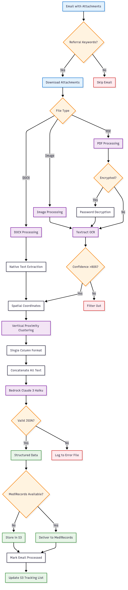

# 📘 Components & Technical Details

## Architecture & AWS Services

### Core AWS Services
- **AWS Lambda**: Serverless execution environment for the main processing pipeline
- **AWS Textract**: OCR service for extracting text from PDFs and images with confidence scoring
- **AWS Bedrock**: LLM service using Claude 3 Haiku for structured data extraction
- **AWS S3**: Storage for processed referrals and tracking processed emails
- **AWS Secrets Manager**: Secure storage for API credentials and sensitive configuration
- **AWS CloudWatch**: Logging and monitoring (integrated with Lambda)

### Microsoft Graph API Integration
- **Authentication**: OAuth 2.0 client credentials flow
- **Email Processing**: Filters emails with attachments containing referral keywords
- **Rate Limiting**: 10-second timeout for API calls
- **Password Extraction**: Assumes password is the last word in email subject line

---

## System Architecture & Component Interactions
<p align="center">
  
</p>

### Detailed Component Interaction Flow

<p align="center">
  
</p>

### Data Flow Architecture

<p align="center">
  
</p>
---

## Technical Workflow

### 1. **Email Extraction & Authentication**
- **Microsoft Graph API Setup**:
  - Tenant ID, Client ID, and Client Secret stored in AWS Secrets Manager
  - OAuth 2.0 client credentials flow for authentication
  - Access token retrieval with 10-second timeout
- **Email Filtering**:
  - Searches for emails with attachments (`hasAttachments eq true`)
  - Filters by referral keywords:stored in `referral_automation/config.py`
  - Processes up to 10 emails per run (configurable)
  - Extracts password from last word of email subject for encrypted PDFs

### 2. **Attachment Processing & OCR**
- **File Type Detection**: Supports PDF, DOCX, JPG, JPEG, PNG
- **AWS Textract Configuration**:
  - Feature types: TABLES, FORMS for comprehensive extraction
  - Confidence threshold: >80% for text line filtering
  - Spatial coordinate extraction (x, y positions) for clustering
- **PDF Processing**:
  - Handles encrypted PDFs with password decryption using PyPDF2
  - Processes first and last pages for multi-page documents
  - Falls back to Textract for encrypted PDFs that can't be decrypted
- **Image Processing**: Direct Textract processing for JPG, JPEG, PNG
- **DOCX Processing**: Uses `docx2txt` library for native text extraction

### 3. **Text Processing & Clustering Algorithm**
- **Textract Output Processing**:
  - Extracts text blocks with spatial coordinates
  - Filters lines by confidence score (>80%)
  - Clusters text blocks based on vertical proximity (y-coordinates)
- **Single Column Conversion**:
  - Converts clustered blocks to numbered format
  - Format: `Block 1\n[text lines]\n\nBlock 2\n[text lines]\n\n`
  - Optimized for LLM consumption
- **Text Concatenation**: Combines all extracted text from multiple attachments

### 4. **Structured Data Extraction (AWS Bedrock)**
- **LLM Model**: Claude 3 Haiku (`anthropic.claude-3-haiku-20240307-v1:0`)
- **Configuration**:
  - Max tokens: 1000
  - Temperature: 0.1 (low randomness for consistent extraction)
  - Anthropic version: bedrock-2023-05-31
- **JSON Parsing**:
  - Uses BEGIN_JSON/END_JSON markers
  - Validates JSON structure before processing
  - Handles missing fields with null values
- **Extracted Fields**:
  - Patient: Title, Last Name, First Name, DOB, Address, Phone
  - Referring Doctor: Title, Last Name, First Name, Address, Provider No
  - Referred Doctor: Title, Last Name, First Name, Address, Phone Number, Email
  - Reason: Concise summary (1-2 sentences, max 100 words)

### 5. **Data Delivery & Storage**
- **Primary Delivery**: MediRecords API integration
- **Fallback Storage**: AWS S3 with structured file naming
  - Format: `referrals/{LastName}_{FirstName}_{DOB}_{timestamp}.json`
  - Sanitized file names (unsafe characters replaced with "_")
- **Processed Email Tracking**: S3-stored JSON list (last 100 entries)
- **Error Handling**: Comprehensive logging and error recovery

---

## Configuration & Environment

### AWS Configuration (`referral_automation/config.py`)
```python
REGION_NAME = 'ap-southeast-2'
SECRETS_MANAGER_ID = 'Medirecords_credentials'
S3_BUCKET = 'enas3bucket'
PROCESSED_FILE_KEY = "processed_emails.json"
GET_EMAIL_COUNT_PER_RUN = 10
LOG_LEVEL = 'info'
IS_LOCAL = 'False'
```

### Required AWS Secrets Manager Structure
```json
{
  "GRAPH_TENANT_ID": "your-tenant-id",
  "GRAPH_CLIENT_ID": "your-client-id", 
  "GRAPH_CLIENT_SECRET": "your-client-secret",
  "GRAPH_USER_EMAIL": "your-email@domain.com",
  "MEDIRECORDS_API_KEY": "your-api-key",
  "MEDIRECORDS_ENDPOINT": "your-api-endpoint"
}
```

### Dependencies (`requirements.txt`)
- **AWS SDK**: boto3==1.33.13, botocore==1.33.13
- **Document Processing**: docx2txt==0.8, pypdf2==3.0.1, Pillow==9.5.0
- **Encryption**: pycryptodomex==3.19.0
- **HTTP/API**: requests==2.31.0, beautifulsoup4==4.13.4
- **Utilities**: python-dateutil==2.9.0.post0, typing-extensions==4.14.0

---

## Error Handling & Logging

### Logging Configuration
- **Log Levels**: Configurable (DEBUG, INFO, WARNING, ERROR, CRITICAL)
- **Local vs Lambda**: Different formatting for local testing vs Lambda execution
- **Error Tracking**: Detailed error logging to `error_log.txt`
- **CloudWatch Integration**: Automatic Lambda log forwarding

### Error Scenarios
- **No Text Extracted**: File skipped with warning logged
- 🔒**Encrypted PDF**: Attempts password decryption, falls back to Textract
- 🧠**LLM Parsing Failure**: JSON validation errors logged to error file
- 🔁**Delivery Failure**: MediRecords delivery failure logged, S3 fallback attempted
- ⏳**API Timeouts**: 10-second timeout for Microsoft Graph API calls
- 🔁**Duplicate Processing**: Email ID tracking prevents reprocessing

---

## Common Issues & Troubleshooting

| Issue               | Resolution                                 |
| ------------------- | ------------------------------------------ |
| Poor OCR quality    | Ensure 300+ DPI, standard templates         |
| Missing fields      | Use better scan resolution / template      |
| Encrypted PDF fails | Check password handling logic              |
| LLM errors          | Inspect prompt formatting + token limits   |
| API throttling      | Reduce call rate or increase retry delay   |
| Large Attachments   | Memory constraints in Lambda environment   |
| Textract Processing | Long processing times for complex documents|
| Network Latency     | AWS region considerations                  |

---

### Debugging Steps
1. **Check Logs**: Review CloudWatch logs for detailed error information
2. **Verify Credentials**: Ensure all secrets are properly configured
3. **Test File Processing**: Validate individual file extraction
4. **Monitor API Limits**: Check Microsoft Graph API usage
5. **Review S3 Access**: Verify bucket permissions and file access

---

## Suggested Enhancements
* ✅ Implement post-processing Field validation
* 📈 Add batch email processing support
* 📦 CloudWatch alarms for failed LLM extraction or API failures
* 🔁 Retry logic for transient failures
* 📈 Add structured logs with JSON format for analysis

---

## File Hierarchy

```
referralemailwork/
├── error_log.txt
├── packages/
├── referral_automation/
│   ├── config.py
│   ├── lambda_function.py
│   └── referral_processor/
│       ├── logger_config.py
│       ├── secret_manager.py
│       ├── attachment_processor/
│       │   ├── __init__.py
│       │   ├── docx.py
│       │   ├── extractor.py
│       │   ├── image.py
│       │   ├── ocr_to_cluster.py
│       │   ├── pdf.py
│       │   ├── textract.py
│       ├── deliver_and_storage/
│       │   ├── __init__.py
│       │   ├── delivery.py
│       │   ├── medirecords_delivery.py
│       │   ├── s3_utils.py
│       ├── email_extractor/
│       │   ├── __init__.py
│       │   ├── graph_client.py
│       ├── llm_parser/
│       │   ├── __init__.py
│       │   ├── bedrock_extractor.py
│       │   ├── prompt_template.txt
│       │   ├── prompt.py
├── requirements.txt
├── run.py
├── zip.py
``` 


## Troubleshooting

### Common Problems

| Issue               | Resolution                               |
| ------------------- | ---------------------------------------- |
| Poor OCR quality    | Ensure 300 DPI, standard templates       |
| Missing fields      | Use better scan resolution / template    |
| Encrypted PDF fails | Check password handling logic            |
| LLM errors          | Inspect prompt formatting + token limits |
| API throttling      | Reduce call rate or increase retry delay |

### Debug Steps

1. Check CloudWatch logs
2. Confirm credentials in Secrets Manager
3. Manually test one file
4. Ensure `IS_LOCAL` is set properly for environment

---

## Suggested Enhancements

* ✅ Add batch email processing support
* 📦 CloudWatch alarms for failed LLM extraction or API failures
* 🔁 Retry logic for transient failures
* 🧪 Add unit and integration tests
* 📈 Add structured logs with JSON format for analysis


