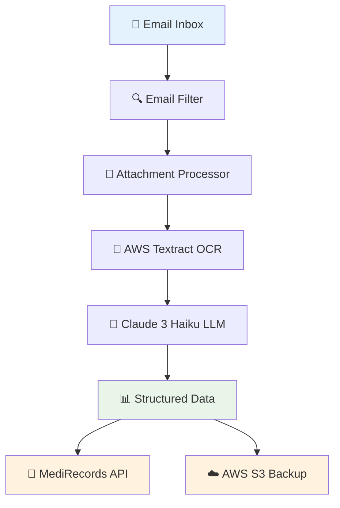
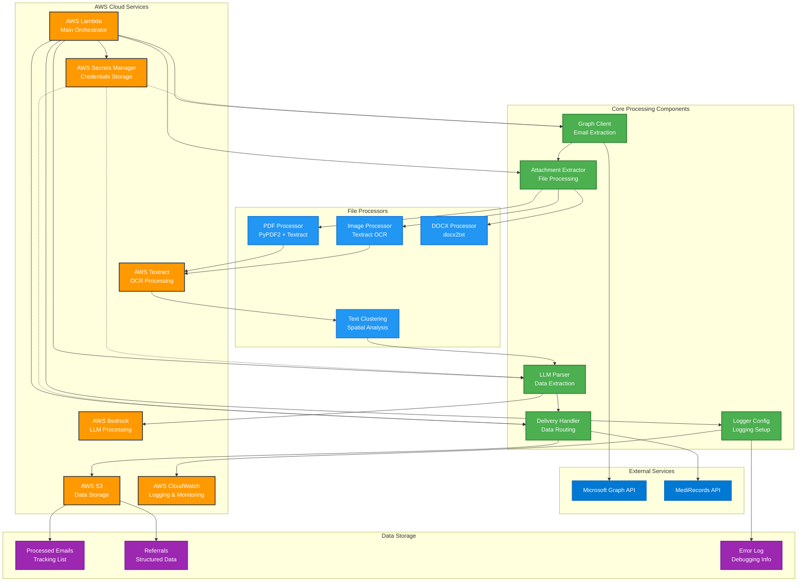
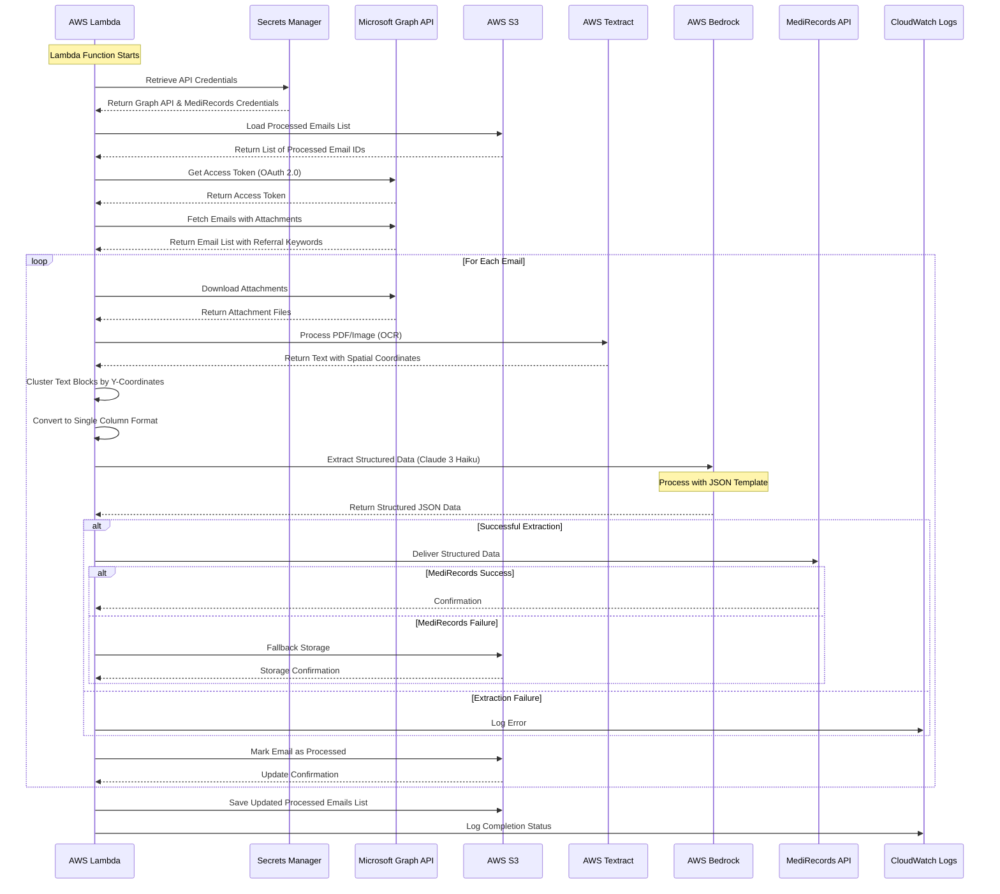
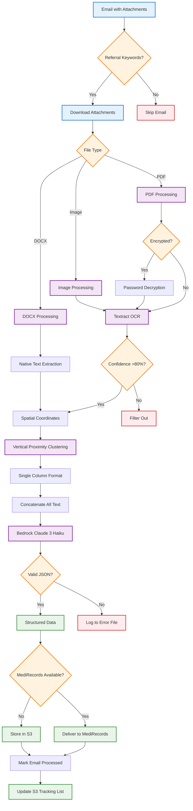

## High Level Architecture

```mermaid
graph TB
    A[📧 Email Inbox] --> B[🔍 Email Filter]
    B --> C[📎 Attachment Processor]
    C --> D[🤖 AWS Textract OCR]
    D --> E[🧠 Claude 3 Haiku LLM]
    E --> F[📊 Structured Data]
    F --> G[🏥 MediRecords API]
    F --> H[☁️ AWS S3 Backup]
    
    style A fill:#E3F2FD
    style F fill:#E8F5E8
    style G fill:#FFF3E0
    style H fill:#FFF3E0
```

---

## System Architecture & Component Interactions

```mermaid
graph TB
    %% External Services
    subgraph "External Services"
        MSGraph[Microsoft Graph API]
        MediRecords[MediRecords API]
    end
    
    %% AWS Services
    subgraph "AWS Cloud Services"
        Lambda[AWS Lambda<br/>Main Orchestrator]
        Secrets[AWS Secrets Manager<br/>Credentials Storage]
        S3[AWS S3<br/>Data Storage]
        Textract[AWS Textract<br/>OCR Processing]
        Bedrock[AWS Bedrock<br/>LLM Processing]
        CloudWatch[AWS CloudWatch<br/>Logging & Monitoring]
    end
    
    %% Core Components
    subgraph "Core Processing Components"
        GraphClient[Graph Client<br/>Email Extraction]
        Extractor[Attachment Extractor<br/>File Processing]
        LLMParser[LLM Parser<br/>Data Extraction]
        Delivery[Delivery Handler<br/>Data Routing]
        Logger[Logger Config<br/>Logging Setup]
    end
    
    %% File Processors
    subgraph "File Processors"
        PDFProcessor[PDF Processor<br/>PyPDF2 + Textract]
        ImageProcessor[Image Processor<br/>Textract OCR]
        DOCXProcessor[DOCX Processor<br/>docx2txt]
        ClusterProcessor[Text Clustering<br/>Spatial Analysis]
    end
    
    %% Storage & Tracking
    subgraph "Data Storage"
        ProcessedEmails[Processed Emails<br/>Tracking List]
        Referrals[Referrals<br/>Structured Data]
        ErrorLog[Error Log<br/>Debugging Info]
    end
    
    %% Flow Connections
    Lambda --> Secrets
    Lambda --> GraphClient
    Lambda --> Extractor
    Lambda --> LLMParser
    Lambda --> Delivery
    Lambda --> Logger
    
    %% Email Flow
    GraphClient --> MSGraph
    GraphClient --> Extractor
    
    %% File Processing Flow
    Extractor --> PDFProcessor
    Extractor --> ImageProcessor
    Extractor --> DOCXProcessor
    PDFProcessor --> Textract
    ImageProcessor --> Textract
    Textract --> ClusterProcessor
    ClusterProcessor --> LLMParser
    
    %% LLM Processing
    LLMParser --> Bedrock
    LLMParser --> Delivery
    
    %% Delivery Flow
    Delivery --> MediRecords
    Delivery --> S3
    
    %% Storage Flow
    S3 --> ProcessedEmails
    S3 --> Referrals
    Logger --> ErrorLog
    Logger --> CloudWatch
    
    %% Configuration & Secrets
    Secrets -.-> GraphClient
    Secrets -.-> Delivery
    Secrets -.-> LLMParser
    
    %% Styling
    classDef aws fill:#FF9900,stroke:#232F3E,stroke-width:2px,color:#fff
    classDef external fill:#0078D4,stroke:#106EBE,stroke-width:2px,color:#fff
    classDef component fill:#4CAF50,stroke:#2E7D32,stroke-width:2px,color:#fff
    classDef processor fill:#2196F3,stroke:#1976D2,stroke-width:2px,color:#fff
    classDef storage fill:#9C27B0,stroke:#7B1FA2,stroke-width:2px,color:#fff
    
    class Lambda,Secrets,S3,Textract,Bedrock,CloudWatch aws
    class MSGraph,MediRecords external
    class GraphClient,Extractor,LLMParser,Delivery,Logger component
    class PDFProcessor,ImageProcessor,DOCXProcessor,ClusterProcessor processor
    class ProcessedEmails,Referrals,ErrorLog storage
```

---

### Detailed Component Interaction Flow

```mermaid
sequenceDiagram
    participant Lambda as AWS Lambda
    participant Secrets as Secrets Manager
    participant Graph as Microsoft Graph API
    participant S3 as AWS S3
    participant Textract as AWS Textract
    participant Bedrock as AWS Bedrock
    participant MediRecords as MediRecords API
    participant CloudWatch as CloudWatch Logs
    
    Note over Lambda: Lambda Function Starts
    Lambda->>Secrets: Retrieve API Credentials
    Secrets-->>Lambda: Return Graph API & MediRecords Credentials
    
    Lambda->>S3: Load Processed Emails List
    S3-->>Lambda: Return List of Processed Email IDs
    
    Lambda->>Graph: Get Access Token (OAuth 2.0)
    Graph-->>Lambda: Return Access Token
    
    Lambda->>Graph: Fetch Emails with Attachments
    Graph-->>Lambda: Return Email List with Referral Keywords
    
    loop For Each Email
        Lambda->>Graph: Download Attachments
        Graph-->>Lambda: Return Attachment Files
        
        Lambda->>Textract: Process PDF/Image (OCR)
        Textract-->>Lambda: Return Text with Spatial Coordinates
        
        Lambda->>Lambda: Cluster Text Blocks by Y-Coordinates
        Lambda->>Lambda: Convert to Single Column Format
        
        Lambda->>Bedrock: Extract Structured Data (Claude 3 Haiku)
        Note over Bedrock: Process with JSON Template
        Bedrock-->>Lambda: Return Structured JSON Data
        
        alt Successful Extraction
            Lambda->>MediRecords: Deliver Structured Data
            alt MediRecords Success
                MediRecords-->>Lambda: Confirmation
            else MediRecords Failure
                Lambda->>S3: Fallback Storage
                S3-->>Lambda: Storage Confirmation
            end
        else Extraction Failure
            Lambda->>CloudWatch: Log Error
        end
        
        Lambda->>S3: Mark Email as Processed
        S3-->>Lambda: Update Confirmation
    end
    
    Lambda->>S3: Save Updated Processed Emails List
    Lambda->>CloudWatch: Log Completion Status
```

---

### Data Flow Architecture

```mermaid
flowchart TD
    %% Input Sources
    Email[Email with Attachments] --> Filter{Referral Keywords?}
    Filter -->|Yes| Download[Download Attachments]
    Filter -->|No| Skip[Skip Email]
    
    %% File Processing
    Download --> FileType{File Type}
    FileType -->|PDF| PDFProcess[PDF Processing]
    FileType -->|Image| ImageProcess[Image Processing]
    FileType -->|DOCX| DOCXProcess[DOCX Processing]
    
    %% OCR Processing
    PDFProcess --> Encrypted{Encrypted?}
    Encrypted -->|Yes| Password[Password Decryption]
    Encrypted -->|No| Textract[Textract OCR]
    Password --> Textract
    ImageProcess --> Textract
    DOCXProcess --> NativeText[Native Text Extraction]
    
    %% Text Processing
    Textract --> Confidence{Confidence >80%?}
    Confidence -->|Yes| Spatial[Spatial Coordinates]
    Confidence -->|No| FilterOut[Filter Out]
    NativeText --> Spatial
    
    %% Clustering
    Spatial --> Cluster[Vertical Proximity Clustering]
    Cluster --> SingleColumn[Single Column Format]
    SingleColumn --> Concatenate[Concatenate All Text]
    
    %% LLM Processing
    Concatenate --> LLM[Bedrock Claude 3 Haiku]
    LLM --> JSONParse{Valid JSON?}
    JSONParse -->|Yes| StructuredData[Structured Data]
    JSONParse -->|No| ErrorLog[Log to Error File]
    
    %% Delivery
    StructuredData --> Deliver{MediRecords Available?}
    Deliver -->|Yes| MediRecords[Deliver to MediRecords]
    Deliver -->|No| S3Storage[Store in S3]
    
    %% Tracking
    MediRecords --> Track[Mark Email Processed]
    S3Storage --> Track
    Track --> UpdateS3[Update S3 Tracking List]
    
    %% Styling
    classDef input fill:#E3F2FD,stroke:#1976D2,stroke-width:2px
    classDef process fill:#F3E5F5,stroke:#7B1FA2,stroke-width:2px
    classDef decision fill:#FFF3E0,stroke:#F57C00,stroke-width:2px
    classDef output fill:#E8F5E8,stroke:#388E3C,stroke-width:2px
    classDef error fill:#FFEBEE,stroke:#D32F2F,stroke-width:2px
    
    class Email,Download input
    class PDFProcess,ImageProcess,DOCXProcess,Textract,Cluster,LLM process
    class Filter,FileType,Encrypted,Confidence,JSONParse,Deliver decision
    class StructuredData,MediRecords,S3Storage,UpdateS3 output
    class Skip,FilterOut,ErrorLog error
```

---
